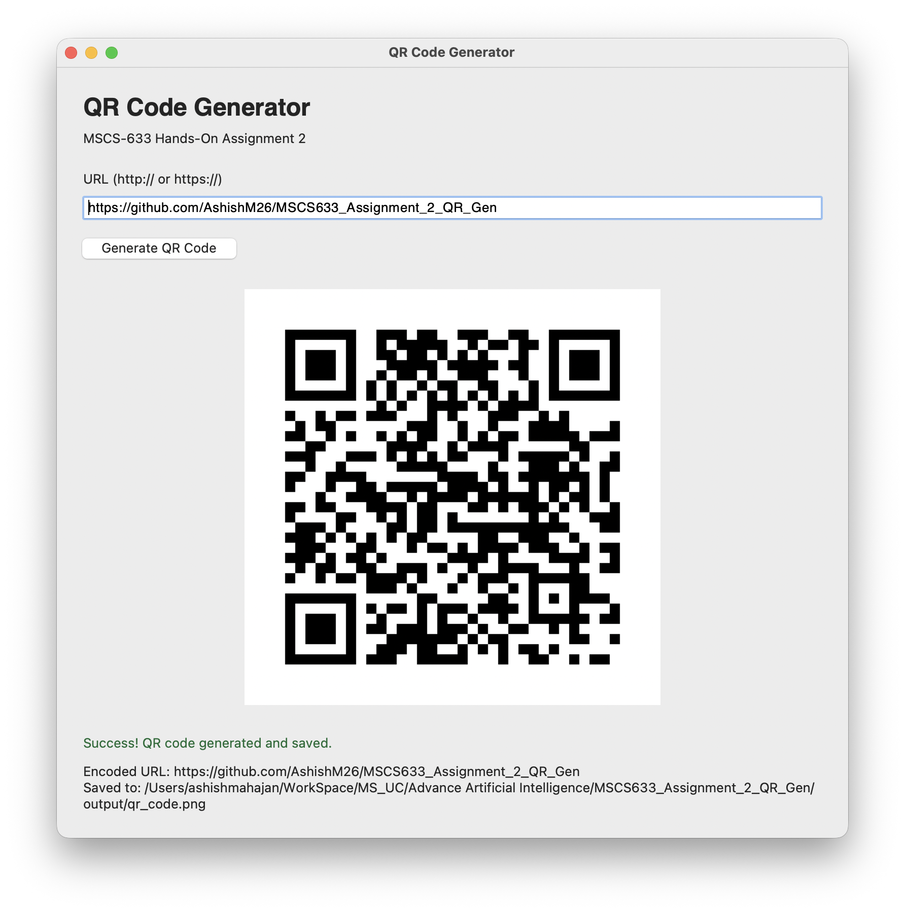

# MSCS-633 Hands-On Assignment 2
## QR Code Generator with Python

### Overview
A small Python desktop application that turns an HTTP or HTTPS URL into a QR code, displays it, and saves a PNG. Author: Ashish Bhanudas Mahajan. Course: MSCS-633-M20 — Advanced Artificial Intelligence.

### Assignment Objective
Build a working URL-to-QR application with readable source, dependencies, runtime evidence, and a Word report. Although the assignment title uses “AI QR Code Generator,” QR encoding is a deterministic data-encoding process; this project uses no machine-learning model.

### Features
- Enter a URL and click **Generate QR Code** or press Enter.
- Validate the scheme, hostname, and optional port; show clear input errors.
- Generate a black-and-white QR with automatic version fitting, medium error correction, 10-pixel modules, and a four-module border.
- Display the result and show its encoded URL and absolute output path.
- Handle invalid input, QR capacity limits, and file/display errors.

### Project Structure
```text
MSCS633_Assignment_2_QR_Gen/
├── qr_generator.py
├── requirements.txt
├── README.md
├── .gitignore
├── output/qr_code.png
├── screenshots/
│   ├── application_output.png
│   └── README.md
├── report/
│   ├── MSCS633_Hands_On_Assignment_2_Report.docx
│   └── report_text.md
└── tests/test_qr_generator.py
```
The genuine application screenshot is embedded in the Word report and included separately for inspection.

### Technologies Used
Python, Tkinter/ttk, qrcode, Pillow, pathlib, urllib.parse, and unittest. Runtime packages are pinned in `requirements.txt`; tests use the standard library. Tkinter is supplied by Python/your operating system, not pip.

### Prerequisites
Python 3.10 or newer with Tkinter and a graphical desktop. Tested on macOS with Python 3.11.1 and Tk 8.6. Check Tk with `python -m tkinter`. If unavailable, use a Python installation with Tk support; on Ubuntu/Debian install the matching `python3-tk` package. Internet is needed for dependency installation, but QR generation works offline.

### Installation
```bash
git clone https://github.com/AshishM26/MSCS633_Assignment_2_QR_Gen.git
cd MSCS633_Assignment_2_QR_Gen
```
macOS/Linux:
```bash
python3 -m venv .venv
source .venv/bin/activate
```
Windows PowerShell:
```powershell
py -m venv .venv
.\.venv\Scripts\Activate.ps1
```
If PowerShell activation is restricted, use `.venv\Scripts\python.exe` in place of `python` below.

Install dependencies:
```bash
python -m pip install -r requirements.txt
```
In VS Code, open this folder and select `.venv` as the Python interpreter.

### Running the Application
```bash
python qr_generator.py
```
Enter an HTTP/HTTPS URL, then click **Generate QR Code**. Empty or malformed input displays an error without closing the application. Surrounding whitespace is trimmed; embedded whitespace and credentials are rejected. Localhost, IP addresses, and internationalized hostnames are supported. Validation checks syntax, not whether the website exists or is safe.

### Example
Use:
```text
https://github.com/AshishM26/MSCS633_Assignment_2_QR_Gen
```
The window displays the QR code, a success message, the encoded URL, and the saved path.


This image is the generated PNG, not an application screenshot.

### Testing
```bash
python -m unittest discover -s tests -v
python -m compileall -q qr_generator.py tests
python -m pip check
```
Fourteen tests cover valid/invalid URLs, hosts/ports, PNG generation, directory creation, whitespace normalization, capacity overflow, file errors, replacement of saved output, and preservation of the previous PNG after invalid input. All passed during validation.

Optional development-only lint checks (Ruff is not needed to run the app):
```bash
python -m pip install ruff==0.16.8
python -m ruff check --select E,F,I --line-length 88 qr_generator.py tests
python -m ruff format --check qr_generator.py tests
```
The saved PNG was decoded using the built-in macOS Vision framework and matched the exact repository URL. The actual Tkinter window was launched and exercised through its button callback with valid, empty, malformed, and oversized input. This was an automated desktop smoke check, not a claim of student manual testing.

### Output
`output/qr_code.png` is saved relative to the script, regardless of the terminal's current folder. Each successful generation replaces the previous PNG. Invalid input clears the preview but leaves any previously saved PNG unchanged.

### Application Screenshot


The screenshot was captured and supplied by the student. It shows the entered repository URL, QR code, success message, and saved path. The same image is embedded in the Word report.

**Submission:** Attach `report/MSCS633_Hands_On_Assignment_2_Report.docx` in Blackboard and include the repository URL to share the Python source and manifest. All required artifacts are included; review the document before submitting.

### Repository
https://github.com/AshishM26/MSCS633_Assignment_2_QR_Gen

### Assignment Deliverables
| Requirement | Repository evidence | Status |
|---|---|---|
| Python source code | [qr_generator.py](qr_generator.py) | Complete |
| Dependency manifest | [requirements.txt](requirements.txt) | Complete; runtime packages pinned |
| Screenshot in Word document | [Word report](report/MSCS633_Hands_On_Assignment_2_Report.docx) | Complete; genuine screenshot embedded |
| GitHub link to share code | [Public repository](https://github.com/AshishM26/MSCS633_Assignment_2_QR_Gen) | Available |
| Coding best practices and comments | Small functions, type hints, docstrings, focused comments, error handling, pathlib, main guard, tests | Checked |

The Word report is the Blackboard document deliverable. Share the repository URL alongside it. The report includes the genuine application output screenshot and a clickable repository link.

### Learning Outcomes
Practice separating validation and QR generation from GUI event handling, managing dependencies, handling errors, testing reusable functions, and documenting a reproducible desktop application.

### Technical References
- [qrcode package documentation](https://pypi.org/project/qrcode/)
- [Python URL parsing documentation](https://docs.python.org/3/library/urllib.parse.html)
